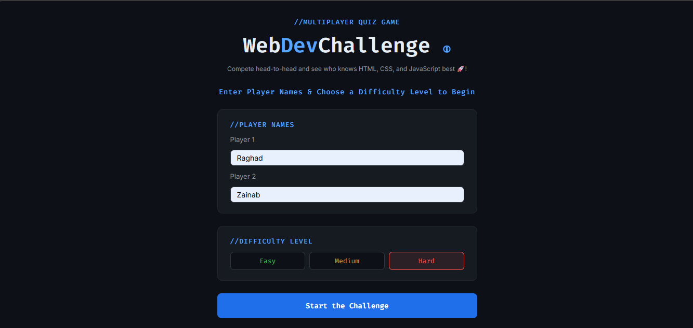
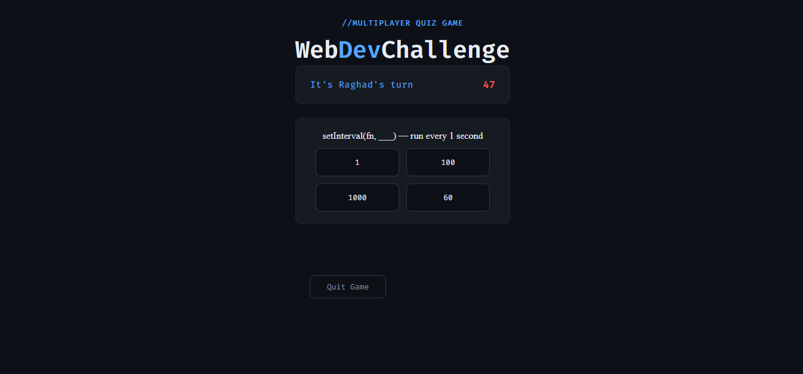
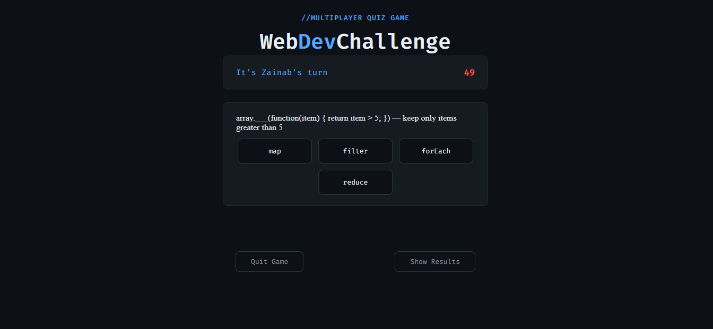
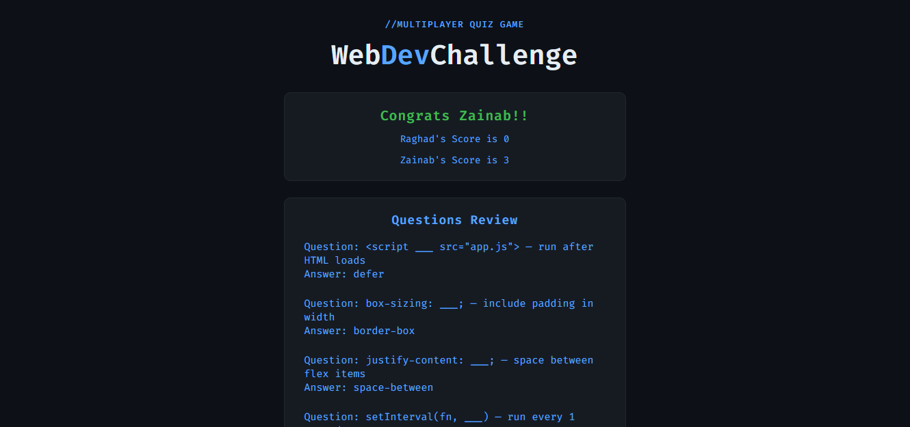

# WebDevChallenge

## Technologies 
- HTML 
- CSS
- JavaScript
- Github

## Description
Multiplayer code quiz game. Built to test your knowledge in HTML, CSS, and JavaScript. The game starts by entering yours and you friends name and selecting the difficulty level. Each round runs on one minute timer with five complete the code questions each. The player who answers more questions correctly wins. You can see yours and your friends score after the game completes and review the questions to see the right answers. 

## User Stories
1. As a User, I want multiple choice quiz game.
2.	As a User, I want to have questions in various levels.
3.	As a User, I want to play with my friend.
4.  As a User, I want to enter my name and my friends name before the game.
5.	As a User, I want to have an option to quit the game at any time.
6.	As a User, I want a timer for the game for each turn.
7.	As a User, I want to know if it’s my turn.
8.	As a User, I want to see my and my friend score after the game.
9.	As a User, I want to see the right answers after the game. 

## Screenshots

## Future Enhancements
1. Add more players.
2. User chooses the number of players.
3. Light mode option.
4. Add more programming languages questions. 
5. User chooses time and number of questions.

## Credits
Special thanks to Mr.Omer, without his support this project wouldn’t have come together  